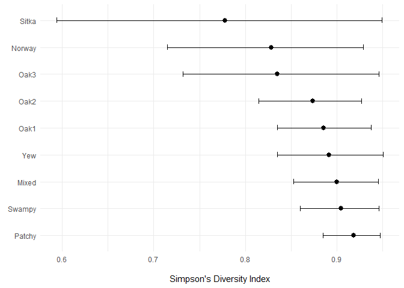
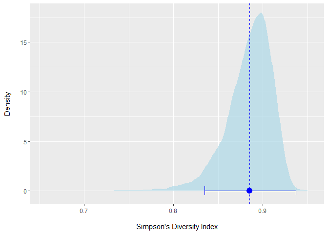
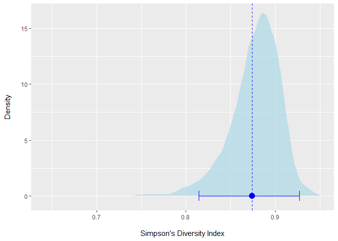
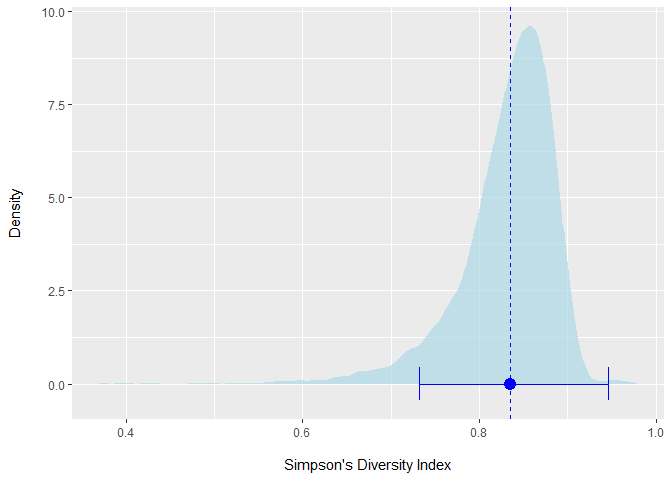
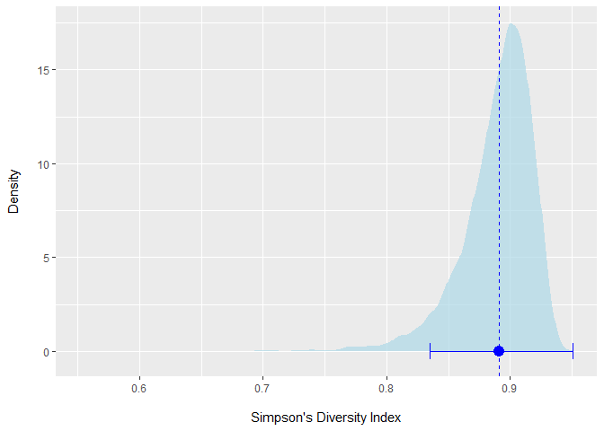
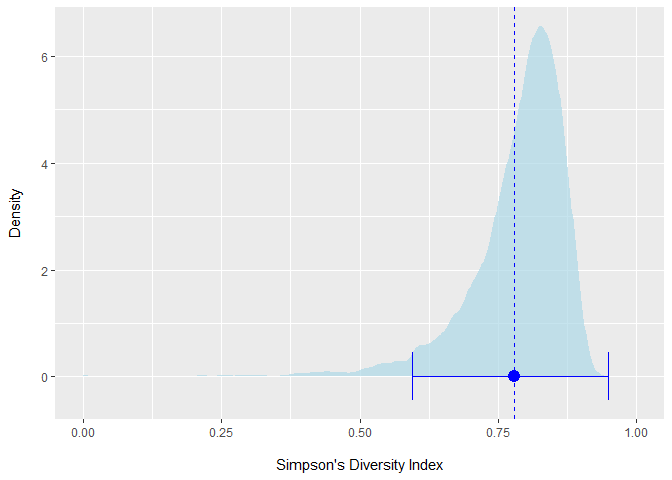
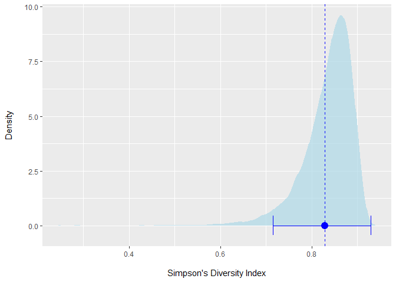
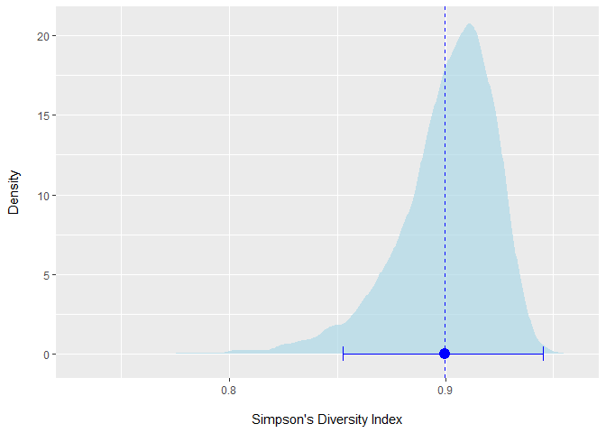
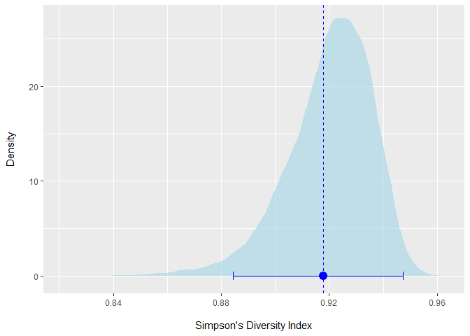
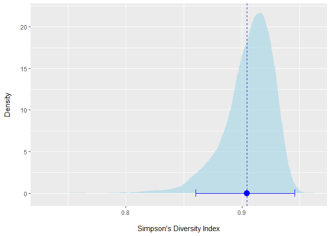

## Setup

```{.r .fold-show}
library(boot)
library(tidyverse)

birds <- read_csv("Data/KillarneyBirds.csv")
```
<br>

## **Bootstrapping Simpson's Diversity Index (SDI) for Each Habitat**
<br>
Our lesson example provided code for bootstrapping a single variable from the Killarney Birds data set.

```{.r .fold-show}
# Simpson's Diversity Index Function Bootstrapping
sdiBootFunc <- function(x, indicies) {
  y <- x[indicies]
  N <- sum(y)
  D <- 1 - sum(y*(y-1)) / (N*(N-1))
  D
}

# Single Variable Bootstrapping using boot()
sdiOakBoot <- boot(birds$Oak1, sdiBootFunc, R=1e4)
```
<br>

I expanded the code for practicality purposes to complete the bootstrapping of the SDI function for each habitat all at once using `lapply`. This results in a data frame of lists that can be referenced using base R indexing for plotting.

```{.r .fold-show}
# Multi-Variable Function Bootstrapping
results <- lapply(birds[-1],  boot, statistic = sdiBootFunc, R = 1e4) # calculates SDI for each habitat, drops species column
results.ci <- lapply(results, boot.ci, type = "norm") # calculates normal confidence intervals for each habitat
```
<br>

## **Differences in Bird Community Diversity Based on SDI** {.tabset .tabset-pills}

I generated a table from the bootstrap lists to plot the differences in bird community diversity (SDI) by habitat. At a glance, the plot of each of the habitat SDIs and bootstrapped normal confidence intervals have a significant amount of overlap. This suggests that our methods were unable to identify significant differences between habitats.


```r
results.df <- data.frame(row.names = 1:9,
                         Habitat = names(results),
                         SDI = round(sapply(results, function(x) x$t0),4),
                         CI.lower = round(sapply(results.ci, function(x) x$normal[2]),4),
                         CI.upper = round(sapply(results.ci, function(x) x$normal[3]),4))

ggplot(data = results.df, mapping = aes(x=SDI,y=reorder(Habitat,-SDI), xmin = CI.lower, xmax = CI.upper)) +
  geom_errorbar(width = 0.2) +
  geom_pointrange() +
  labs(x="\nSimpson's Diversity Index",y=element_blank()) +
  theme_minimal()
```

<!-- -->
<br>


### Oak1

```r
ggplot() + geom_density(mapping=aes(x=results$Oak1$t),
                        fill="lightblue",color=NA,alpha=0.7) + 
  geom_vline(xintercept = results$Oak1$t0,color="blue",linetype="dashed") +
  labs(x="\nSimpson's Diversity Index",y="Density\n") +
  geom_errorbarh(mapping=aes(xmin=results.ci$Oak1$normal[2],
                             xmax=results.ci$Oak1$normal[3],
                             y=0),
                 color="blue") +
  geom_point(mapping=aes(x = results$Oak1$t0,y=0),
             color="blue",size=4)
```

<!-- -->

### Oak2

```r
ggplot() + geom_density(mapping=aes(x=results$Oak2$t),
                        fill="lightblue",color=NA,alpha=0.7) + 
  geom_vline(xintercept = results$Oak2$t0,color="blue",linetype="dashed") +
  labs(x="\nSimpson's Diversity Index",y="Density\n") +
  geom_errorbarh(mapping=aes(xmin=results.ci$Oak2$normal[2],
                             xmax=results.ci$Oak2$normal[3],
                             y=0),
                 color="blue") +
  geom_point(mapping=aes(x = results$Oak2$t0,y=0),
             color="blue",size=4)
```

<!-- -->

### Oak3

```r
ggplot() + geom_density(mapping=aes(x=results$Oak3$t),
                        fill="lightblue",color=NA,alpha=0.7) + 
  geom_vline(xintercept = results$Oak3$t0,color="blue",linetype="dashed") +
  labs(x="\nSimpson's Diversity Index",y="Density\n") +
  geom_errorbarh(mapping=aes(xmin=results.ci$Oak3$normal[2],
                             xmax=results.ci$Oak3$normal[3],
                             y=0),
                 color="blue") +
  geom_point(mapping=aes(x = results$Oak3$t0,y=0),
             color="blue",size=4)
```

<!-- -->

### Yew

```r
ggplot() + geom_density(mapping=aes(x=results$Yew$t),
                        fill="lightblue",color=NA,alpha=0.7) + 
  geom_vline(xintercept = results$Yew$t0,color="blue",linetype="dashed") +
  labs(x="\nSimpson's Diversity Index",y="Density\n") +
  geom_errorbarh(mapping=aes(xmin=results.ci$Yew$normal[2],
                             xmax=results.ci$Yew$normal[3],
                             y=0),
                 color="blue") +
  geom_point(mapping=aes(x = results$Yew$t0,y=0),
             color="blue",size=4)
```

<!-- -->

### Sitka

```r
ggplot() + geom_density(mapping=aes(x=results$Sitka$t),
                        fill="lightblue",color=NA,alpha=0.7) + 
  geom_vline(xintercept = results$Sitka$t0,color="blue",linetype="dashed") +
  labs(x="\nSimpson's Diversity Index",y="Density\n") +
  geom_errorbarh(mapping=aes(xmin=results.ci$Sitka$normal[2],
                             xmax=results.ci$Sitka$normal[3],
                             y=0),
                 color="blue") +
  geom_point(mapping=aes(x = results$Sitka$t0,y=0),
             color="blue",size=4)
```

<!-- -->

### Norway

```r
ggplot() + geom_density(mapping=aes(x=results$Norway$t),
                        fill="lightblue",color=NA,alpha=0.7) + 
  geom_vline(xintercept = results$Norway$t0,color="blue",linetype="dashed") +
  labs(x="\nSimpson's Diversity Index",y="Density\n") +
  geom_errorbarh(mapping=aes(xmin=results.ci$Norway$normal[2],
                             xmax=results.ci$Norway$normal[3],
                             y=0),
                 color="blue") +
  geom_point(mapping=aes(x = results$Norway$t0,y=0),
             color="blue",size=4)
```

<!-- -->

### Mixed

```r
ggplot() + geom_density(mapping=aes(x=results$Mixed$t),
                        fill="lightblue",color=NA,alpha=0.7) + 
  geom_vline(xintercept = results$Mixed$t0,color="blue",linetype="dashed") +
  labs(x="\nSimpson's Diversity Index",y="Density\n") +
  geom_errorbarh(mapping=aes(xmin=results.ci$Mixed$normal[2],
                             xmax=results.ci$Mixed$normal[3],
                             y=0),
                 color="blue") +
  geom_point(mapping=aes(x = results$Mixed$t0,y=0),
             color="blue",size=4)
```

<!-- -->

### Patchy

```r
ggplot() + geom_density(mapping=aes(x=results$Patchy$t),
                        fill="lightblue",color=NA,alpha=0.7) + 
  geom_vline(xintercept = results$Patchy$t0,color="blue",linetype="dashed") +
  labs(x="\nSimpson's Diversity Index",y="Density\n") +
  geom_errorbarh(mapping=aes(xmin=results.ci$Patchy$normal[2],
                             xmax=results.ci$Patchy$normal[3],
                             y=0),
                 color="blue") +
  geom_point(mapping=aes(x = results$Patchy$t0,y=0),
             color="blue",size=4)
```

<!-- -->

### Swampy

```r
ggplot() + geom_density(mapping=aes(x=results$Swampy$t),
                        fill="lightblue",color=NA,alpha=0.7) + 
  geom_vline(xintercept = results$Swampy$t0,color="blue",linetype="dashed") +
  labs(x="\nSimpson's Diversity Index",y="Density\n") +
  geom_errorbarh(mapping=aes(xmin=results.ci$Swampy$normal[2],
                             xmax=results.ci$Swampy$normal[3],
                             y=0),
                 color="blue") +
  geom_point(mapping=aes(x = results$Swampy$t0,y=0),
             color="blue",size=4)
```

<!-- -->
