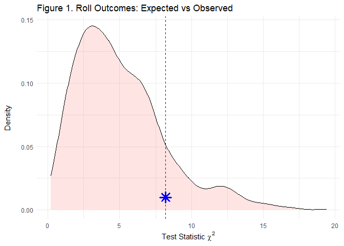
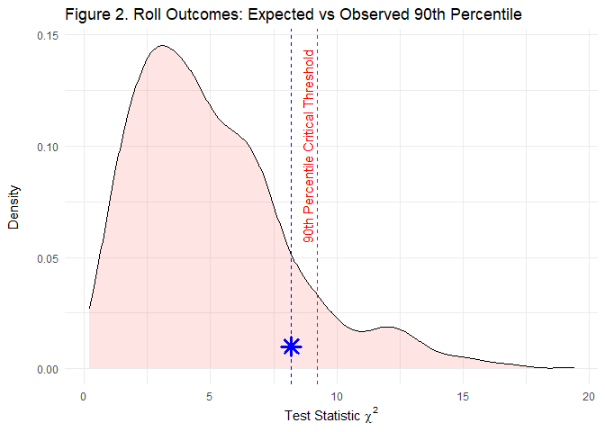

#### Required Libraries

```{.r .fold-show}
library(tidyverse)
```


## **A Crooked Die?**
A die was rolled 60 times. If the die were perfectly fair, the odds of rolling any side of the die should be `1/6` i.e. 10 rolls for each value. A healthy amount of skepticism leads us to believe our die is not fair. After rolling 60 times, here is what we rolled:

<table style='width:30%;'>
<caption>Table 1. Summary of Suspect Die Rolls</caption>
 <thead>
  <tr>
   <th style="text-align:center;"> Value </th>
   <th style="text-align:center;"> Count </th>
  </tr>
 </thead>
<tbody>
  <tr>
   <td style="text-align:center;"> 1 </td>
   <td style="text-align:center;"> 8 </td>
  </tr>
  <tr>
   <td style="text-align:center;"> 2 </td>
   <td style="text-align:center;"> 9 </td>
  </tr>
  <tr>
   <td style="text-align:center;"> 3 </td>
   <td style="text-align:center;"> 18 </td>
  </tr>
  <tr>
   <td style="text-align:center;"> 4 </td>
   <td style="text-align:center;"> 7 </td>
  </tr>
  <tr>
   <td style="text-align:center;"> 5 </td>
   <td style="text-align:center;"> 8 </td>
  </tr>
  <tr>
   <td style="text-align:center;"> 6 </td>
   <td style="text-align:center;"> 10 </td>
  </tr>
</tbody>
</table>


<br>

Our class example walks through the calculation of $\chi^2$ for a single realization of the simulated data. The lines of code used for the single realization will provide the majority of the `for` loop necessary to run permutation testing. My `for` loop will look something like:

```
For (i in 1000)
  Roll possible dice values 60 times
  Count up the dice rolls
  Add dice count summary to a table
  Calculate Chi Sq and store
```

<br>

<details>
  <summary><b>Class Example: Single Realization of Expected Die Rolls</b></summary>

```{.r .fold-show}
### Actual Die Rolls
rollSummary <- tibble(value=1:6, # die values 1 through 6
                      n = c(8,9,18,7,8,10)) # times each die 1:6 was rolled i.e. rolled 1 8 times
rollSummary

### Generate and Compare Theoretical Expectations
# number of times I rolled the die
nRolls <- 60

# the expected outcome for each value nRolls/6=10
Expected <- rep(10,6) # we expected to roll each of the 6 possible rolls 10 times each if it were perfectly fair
Observed <- rollSummary$n

# Chi Sq Test Statistic
obsXsq <- sum((Observed - Expected)^2 / Expected)
obsXsq

possibleValues <- seq(1,6,by=1) # We need this in our For Loop
ranRolls <- tibble(value=sample(x = possibleValues, # And this
                                size = nRolls,
                                replace = TRUE)) 
ranRollsSummary <- ranRolls %>% count(value) # And this
ranRollsSummary
```
</details>
<br>

### Die Roll Permutations
The only major changes to our class example that need to be made are add a line with the `for` loop and add an object for our loop to iterate over:
<!-- Required Work for This Module -->

```{.r .fold-show}
# Die Roll Permutations
nRolls <- 60 # we want to roll the dice 60 times per permutation
mPerm <- 1000 # we want to run 1000 permutations
Expected <- rep(10,6) # we expected to roll each of the 6 possible rolls 10 times each if it were perfectly fair
DiceStat <- numeric() # Output object for dice roll test statistics
  
for(i in 1:mPerm) {
  possibleValues <- seq(1,6,by=1)
  ranRolls <- tibble(value=sample(x = possibleValues,
                                  size = nRolls,
                                  replace = TRUE)) 
  ranRollsSummary <- ranRolls %>% count(value) # The ranRollsSummary is essentially our "Observed" values
  DiceStat[i] <- sum((ranRollsSummary$n - Expected)^2 / Expected) # Stores observations from ranRollsSummary$n, iterates [i] times
}
```
<br>

We now have an object with 1000 $\chi^2$ values from our theoretically fair die.
<br>


```r
# Plot
ggplot() + 
  geom_density(aes(x=DiceStat,fill="red"),alpha=0.2) + 
  geom_vline(xintercept = obsXsq,color="blue",linetype="dashed") + 
  geom_point(aes(x=obsXsq,y=0.01),size=4,shape=8,color="blue",stroke=2) + 
  labs(title = "Figure 1. Roll Outcomes: Expected vs Observed",
       y = "Density\n",
       x = expression("Test Statistic"~chi^2)) +
  theme_minimal() +
  theme(legend.position="none")
```

<!-- -->

### Comparing Probability of Suspect Die and Theoretical Die
Our plot of the suspect die roll (blue dot) $\chi^2$ of **8.2** compared to our expected $\chi^2$ (red area) shows that the suspect die does fall within the range of possible outcomes. To test this:
<br><br>

```
pval <- sum(DiceStat > obsXsq) / mPerm
```
<br>

We end up with a p-value of **0.137** or **13.7%** (only 137 of 1000 simulations were greater than the observed) that the fair die rolls will match the suspect die's outcome. Are the observed die rolls beyond the threshold of suspicion? Well, we don't know. We have to decide how to evaluate our tests. Our observed outcome falls near the upper-tail of our expected $\chi^2$ distribution. If we assume an $\alpha$ of 0.05, then our result appears to always fall below the upper-tail. Even with a more conservative $\alpha% of 0.10, our observed values still fall below our expected upper-tail threshold. This die has certainly fallen off my skeptic radar. We'd have to reject a large number of fair die along with the suspect one! If this die was rejected above the 95th or 99th percentile, I might be more suspicious.
<br>

### Visually Comparing Observed Outcome to Critical Values of Expected $\chi^2$ Distribution


I wanted to visualize the threshold at which I might reject this die as crooked in my previous plot.

A dice has 6 sides or 5 degrees of freedom. We can calculate the upper-tail $\chi^2$ critical value (assuming conservative $\alpha$ = 0.10) of our expected values as **9.24** and plot it. It appears that our die falls below the critical threshold (Figure 2), suggesting our observed rolls accept our $H_{0}$ i.e. that this die is not likely crooked.


```r
# Plotting Threshold
ggplot() + 
  geom_density(aes(x=DiceStat,fill="red"),alpha=0.2) + 
  geom_vline(xintercept = obsXsq,color="blue",linetype="dashed") + 
  geom_vline(xintercept = ChiSqDist.alpha10,color="red",linetype="dashed") +
  annotate("text",
           x = ChiSqDist.alpha10 -0.4,
           y = 0.10,
           colour = "red",
           label=paste("90th Percentile Critical Threshold"),
           angle = 90) +
  geom_point(aes(x=obsXsq,y=0.01),size=4,shape=8,color="blue",stroke=2) + 
  labs(title = "Figure 2. Roll Outcomes: Expected vs Observed 90th Percentile",
       y = "Density\n",
       x = expression("Test Statistic"~chi^2)) +
  theme_minimal() +
  theme(legend.position="none")
```

<!-- -->
<br>
