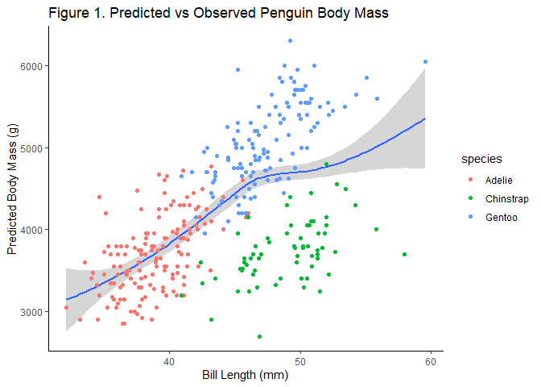
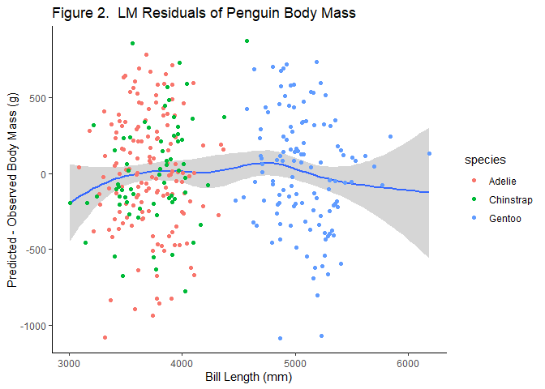

<style>
p.caption {
  font-size: 0.9em;
  font-style: italic;
  text-align: justify;
}
</style>


```r
# Libraries
library(caret)
library(PNWColors)
library(palmerpenguins)
library(tidyverse)
```


<!--- My Work Section --->

# Linear Model of Palmer Penguin Body Mass


I will be working with a simple linear model to assess penguin body mass as a function of bill length and species:
<br><br>
<center> $Body Mass (g)$ ~ $Bill Length + Species$ </center>
<br>


```{.r .fold-show}
# Simple Linear Model

## Load Penguin Data
data(penguins)
penguins <- penguins %>%
  select(-sex) %>% # Drop 'sex' column to remove NAs without removing more data points
  drop_na() # Drop NA data points

## Linear Model
lmMass <- lm(body_mass_g ~ bill_length_mm + species , data = penguins)
```
<br>

# Validation of Linear Model

I will use repeated K-folds cross validation to validate my original linear model:


```{.r .fold-show}
# lm Penguin data: Body Mass ~ Bill Length + Species

## Repeat K-fold CV with caret
fitControl.rcv <- trainControl(
  method = "repeatedcv",
  number = 10,
  repeats = 10)

# Train lm with default parameters
lm.pengu.rcv <- train(body_mass_g ~ bill_length_mm + species, data = penguins,
                      method = "lm",
                      trControl = fitControl.rcv)

Pengu.predict <- penguins
Pengu.predict$yhat.rcv <- predict(lm.pengu.rcv, newdata = Pengu.predict) # new column in penguins with predictions
```
<br>

Figure 1 shows that the linear model appears to capture the general trend in the data points with high variance on both extreme ends. 


```r
# Plotting Predicted vs Observed
ggplot(data = Pengu.predict) +
  geom_smooth(aes(x = bill_length_mm, y = yhat.rcv)) +
  geom_point(aes(x = bill_length_mm, y = body_mass_g, color = species)) +
  theme_classic() +
  labs(title = 'Figure 1. Predicted vs Observed Penguin Body Mass') +
  xlab('Bill Length (mm)') +
  ylab('Predicted Body Mass (g)')
```



<br>
I plotted the residual $Pred\ \hat{y} - Obs\ y$ body mass values and my residuals appear to indicate that my linear model may be underpredicting (Figure 2). If we ignore the extreme ends of the data where the most variance exists, our smooth line of the residuals stays close to the $y=0$ line. I can expect predictions made at the lower and upper ends to be less accurate than between each end.


```r
# Plotting Residuals
ggplot(data = Pengu.predict) +
  geom_smooth(aes(x = yhat.rcv, y = yhat.rcv - body_mass_g)) +
  geom_point(aes(x = yhat.rcv, y = yhat.rcv - body_mass_g, color = species)) +
  theme_classic() +
  labs(title = 'Figure 2.  LM Residuals of Penguin Body Mass') +
  xlab('Bill Length (mm)') +
  ylab('Predicted - Observed Body Mass (g)')
```


<br>

# Results Table

My repeated k-fold cross validated linear model performed nearly the same as my unvalidated model. My final results are shown in Table 1.


```r
# Report mean R^2 and MAE.
lmMass.sum <- summary(lmMass) # Contains r sq value
lmMass.MAE <- mean(abs(lmMass$residuals)) # Calculate lm MAE since not already given
meanRsq.rcv <- mean(lm.pengu.rcv$resample$Rsquared)
meanMAE.rcv <- mean(lm.pengu.rcv$resample$MAE)

# Build Table
penguSummary <- tibble(Model = c('lm', 'lm RCV'),
                      'R^2' = round(c(lmMass.sum$r.squared, meanRsq.rcv), 3),
                      MAE = round(c(lmMass.MAE, meanMAE.rcv), 0))

# Style Table
pengu.crossvaltable <- knitr::kable(penguSummary,
                                    format = "html", table.attr = "style='width:30%;'",
                                    align='rcc',
                                    caption = 'Table 1. Cross Validation Summary') %>%
  kableExtra::kable_styling(position = "center")

pengu.crossvaltable
```

<table style="width:30%; margin-left: auto; margin-right: auto;" class="table">
<caption>Table 1. Cross Validation Summary</caption>
 <thead>
  <tr>
   <th style="text-align:right;"> Model </th>
   <th style="text-align:center;"> R^2 </th>
   <th style="text-align:center;"> MAE </th>
  </tr>
 </thead>
<tbody>
  <tr>
   <td style="text-align:right;"> lm </td>
   <td style="text-align:center;"> 0.783 </td>
   <td style="text-align:center;"> 298 </td>
  </tr>
  <tr>
   <td style="text-align:right;"> lm RCV </td>
   <td style="text-align:center;"> 0.785 </td>
   <td style="text-align:center;"> 300 </td>
  </tr>
</tbody>
</table>
<br><br>

