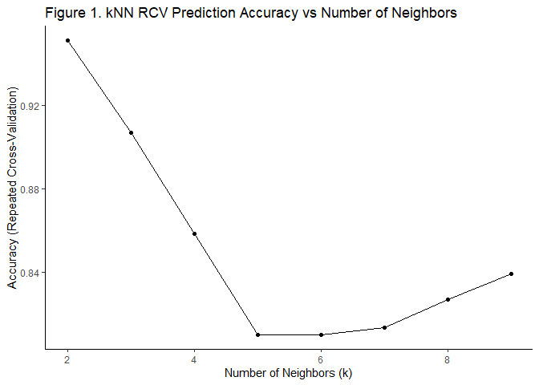

```r
# Libraries
library(caret)
library(class)
library(scales)
library(tidyverse)
```

This module introduced me to kNN – a classification method for categorical data— and expands on my previous module 3 cross-validation exercises using the `caret` package's `trainControl()` and `train()` functions.

> For an unclassified sample, the kNN algorithm finds some number (k) of samples that are close by in a parameter space and classifies the unknown sample by the class membership of the nearest neighbors.

I worked through `kNN()` methods from the `class` package first. Afterwards I walk through similar steps but for cross-validating the kNN predictions using `caret` and `train()`.

## kNN (Not Cross-Validated)

I filtered, normalized, and split my data as suggested in our assignment and created a confusion matrix to determine the accuracy of my kNN predictions compared to my retained test data. I used an arbitrary `k = 3` for my model (this was approximately 4% of the total data).


```r
# kNN (Not CV)

## Data Wrangling
fish <- read_csv("Data/fishcatch.csv")

## Filter and normalize data before splitting
fishFiltered <- fish %>% 
  drop_na() %>%
  filter(common_name %in% c("bream","perch","pike")) %>%
  mutate(common_name = factor(common_name)) %>%
  select(common_name,
         weight_g,
         length_nose2tail_end_cm,
         height_cm,
         width_cm) %>%
  mutate(across(2:5, rescale)) # re-scaled to normalize predictors

## Shuffle data to remove non-random ordering
fish.shuffle <- sample(x = 1:nrow(fishFiltered),size = nrow(fishFiltered),replace = FALSE)
fishFiltered <- fishFiltered[fish.shuffle,]

## Split Data
set.seed(01292021)

train.index <- createDataPartition(fishFiltered$common_name, p = 2/3,
                                   list = F,
                                   times = 1)

fish.train <- fishFiltered[train.index,]
fish.train.cl <- fish.train %>% pull(common_name) # pull labels before removing from data for knn()
fish.train <- fish.train %>% select(-common_name) # remove common name from data to prevent NaN error in knn()

fish.test <- fishFiltered[-train.index,]
fish.test.cl <- fish.test %>% pull(common_name) # pull labels before removing from data for knn()
fish.test <- fish.test %>% select(-common_name) # remove common name from data to prevent NaN error in knn()

## kNN Classification
fish.test.pred <- knn(train = fish.train, 
                      test = fish.test,
                      cl=fish.train.cl,
                      k=3) # arbitrary number ~4% of the total of observations

fish.test.pred
```

#### kNN (No CV) Confusion Matrix


```r
## Confusion Matrix
fish.cm <- confusionMatrix(data = fish.test.pred, reference = fish.test.cl) # confusion matrix
fish.cm
```

```
## Confusion Matrix and Statistics
## 
##           Reference
## Prediction bream perch pike
##      bream     2     0    0
##      perch     0     9    2
##      pike      0     0    0
## 
## Overall Statistics
##                                           
##                Accuracy : 0.8462          
##                  95% CI : (0.5455, 0.9808)
##     No Information Rate : 0.6923          
##     P-Value [Acc > NIR] : 0.1862          
##                                           
##                   Kappa : 0.6061          
##                                           
##  Mcnemar's Test P-Value : NA              
## 
## Statistics by Class:
## 
##                      Class: bream Class: perch Class: pike
## Sensitivity                1.0000       1.0000      0.0000
## Specificity                1.0000       0.5000      1.0000
## Pos Pred Value             1.0000       0.8182         NaN
## Neg Pred Value             1.0000       1.0000      0.8462
## Prevalence                 0.1538       0.6923      0.1538
## Detection Rate             0.1538       0.6923      0.0000
## Detection Prevalence       0.1538       0.8462      0.0000
## Balanced Accuracy          1.0000       0.7500      0.5000
```

My prediction accuracy wasn't terrible, but I have a feeling it will be more believable after cross-validating.
<br>

## kNN with Cross-Validation

 I ran through the kNN methods using the `caret` package to also include repeated cross-validation to test other `k` values. I wanted my kNN to use at least 2 neighbors but was curious whether up to 9 neighbors would have any impact on my prediction accuracy.
 
The code using `caret` to train, cross, validate, and assess prediction accuracy is much neater than the `class` `kNN()` setup and provides more information.


```r
# Cross Validated kNN using Train() from caret package
fish.train <- fishFiltered[train.index,]
fish.test <- fishFiltered[-train.index,]

fitControl <- trainControl(
  method = "repeatedcv",
  number = 10,
  repeats = 10)

fish.knn <- train(common_name ~ ., data = fish.train, 
             method = "knn",
             tuneGrid = expand.grid(k=2:9), # evaluate k = 2, k = 3, etc. up to k = 9
             trControl = fitControl)
fish.knn
```

```
## k-Nearest Neighbors 
## 
## 28 samples
##  4 predictor
##  3 classes: 'bream', 'perch', 'pike' 
## 
## No pre-processing
## Resampling: Cross-Validated (10 fold, repeated 10 times) 
## Summary of sample sizes: 25, 26, 25, 24, 25, 25, ... 
## Resampling results across tuning parameters:
## 
##   k  Accuracy   Kappa    
##   2  0.9508333  0.8492063
##   3  0.9066667  0.7229437
##   4  0.8583333  0.5735931
##   5  0.8100000  0.4126984
##   6  0.8100000  0.4126984
##   7  0.8133333  0.4256854
##   8  0.8266667  0.4776335
##   9  0.8391667  0.5173160
## 
## Accuracy was used to select the optimal model using the largest value.
## The final value used for the model was k = 2.
```
<br>

## kNN Accuracy for Expanded Grid
I plotted the full accuracy grid using my repeated CV kNN classification and there is a clear difference in accuracy between 2-4 neighbors compared to 5-9 (Figure 1).
<br>


```r
# Plot of grid accuracy vs number of neighbors
fish.knn %>% ggplot() +
  theme_classic() +
  labs(title = "Figure 1. kNN RCV Prediction Accuracy vs Number of Neighbors") +
  xlab("Number of Neighbors (k)")
```

<!-- -->

Lastly, my kNN with CV confusion matrix


```r
# confusion matrix
fish.knn.pred <- predict(fish.knn, newdata = fish.test)
confusionMatrix(fish.knn.pred, fish.test$common_name)
```

```
## Confusion Matrix and Statistics
## 
##           Reference
## Prediction bream perch pike
##      bream     2     0    0
##      perch     0     9    1
##      pike      0     0    1
## 
## Overall Statistics
##                                           
##                Accuracy : 0.9231          
##                  95% CI : (0.6397, 0.9981)
##     No Information Rate : 0.6923          
##     P-Value [Acc > NIR] : 0.05688         
##                                           
##                   Kappa : 0.8219          
##                                           
##  Mcnemar's Test P-Value : NA              
## 
## Statistics by Class:
## 
##                      Class: bream Class: perch Class: pike
## Sensitivity                1.0000       1.0000     0.50000
## Specificity                1.0000       0.7500     1.00000
## Pos Pred Value             1.0000       0.9000     1.00000
## Neg Pred Value             1.0000       1.0000     0.91667
## Prevalence                 0.1538       0.6923     0.15385
## Detection Rate             0.1538       0.6923     0.07692
## Detection Prevalence       0.1538       0.7692     0.07692
## Balanced Accuracy          1.0000       0.8750     0.75000
```
<br>

## Final Conclusion

It seems using kNN with 2 neighbors performs nearly the same as 3 neighbors. Predicting with 2 neighbors appears to be more accurate at least with my data set, but using 3 neighbors might provide better predictions to data beyond my training set.
<br><br>
